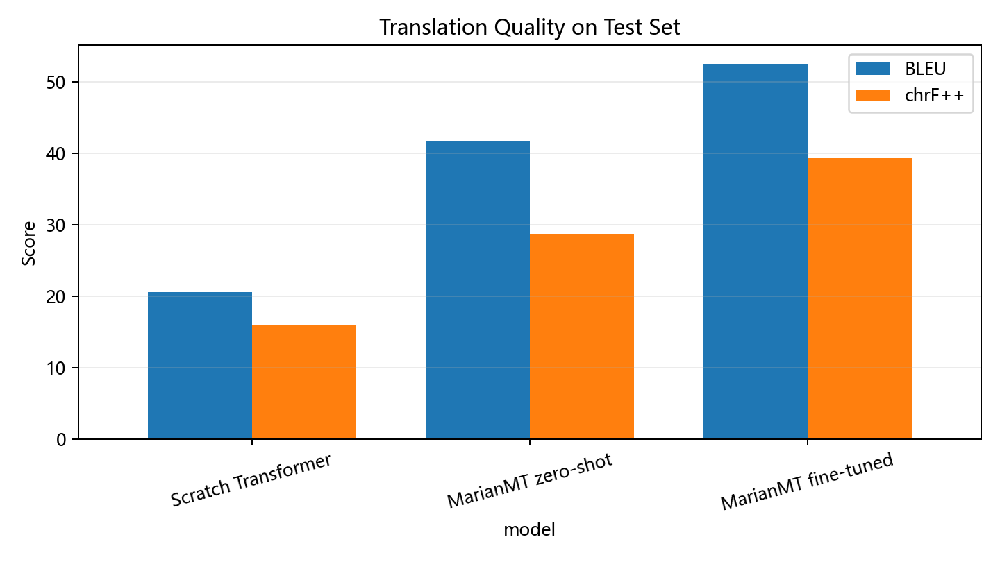

# Transformer English-to-Chinese Translator

[](https://huggingface.co/J1mmymm/transformer-en-zh-translator)
[](LICENSE)

一个可复现的英译中机器翻译项目：从零实现 Encoder–Decoder Transformer，并与 MarianMT 零样本推理及监督微调进行同一测试集对比。代码、评估表和训练曲线在本仓库；可直接推理的微调权重与 scratch checkpoint 发布在 Hugging Face。

## 项目亮点

- 从零实现词表、正弦位置编码、padding/causal mask、teacher forcing、训练与贪心解码。
- 基于 [`Helsinki-NLP/opus-mt-en-zh`](https://huggingface.co/Helsinki-NLP/opus-mt-en-zh) 完成 MarianMT 零样本基线和监督微调。
- 使用同一 2,991 对测试集报告 BLEU、chrF++、TER、Exact Match 和平均译文长度。
- 提供可安装 Python 包、命令行翻译器、完整训练/评估脚本、单元测试和模型卡。

## 结果

| 模型 | BLEU ↑ | chrF++ ↑ | TER ↓ | Exact Match ↑ |
|---|---:|---:|---:|---:|
| Scratch Transformer | 20.5691 | 16.0240 | 66.1049 | 3.0090% |
| MarianMT zero-shot | 41.7833 | 28.7659 | 41.7261 | 2.1398% |
| **MarianMT fine-tuned** | **52.4721** | **39.2654** | **30.8395** | **17.8536%** |



这些结果只适用于当前数据集，并不代表通用领域或长文本翻译质量。微调模型在该划分上的 BLEU 比 zero-shot 提高 10.6888。

## 快速开始

需要 Python 3.10+。建议在虚拟环境中安装：

```bash
git clone https://github.com/J1mmymm/transformer-en-zh-translator.git
cd transformer-en-zh-translator
python -m venv .venv
# Windows: .venv\Scripts\activate
# macOS/Linux: source .venv/bin/activate
pip install -e .
```

直接翻译：

```bash
en-zh-translate "Machine learning is useful."
```

或：

```bash
python -m en_zh_translator "Machine learning is useful."
```

Python 调用：

```python
from transformers import AutoModelForSeq2SeqLM, AutoTokenizer

model_id = "J1mmymm/transformer-en-zh-translator"
tokenizer = AutoTokenizer.from_pretrained(model_id)
model = AutoModelForSeq2SeqLM.from_pretrained(model_id)

batch = tokenizer("Machine learning is useful.", return_tensors="pt")
generated = model.generate(**batch, num_beams=4, max_new_tokens=64)
print(tokenizer.decode(generated[0], skip_special_tokens=True))
```

## 复现实验

### 1. 准备数据

将 UTF-8 编码的平行语料放入：

```text
data/train.txt
data/test.txt
```

每行格式为：

```text
English sentence.\t中文译文。
```

原语料数据包含 26,918 对训练语料和 2,991 对测试语料；脚本用种子 2026 从训练语料中固定划出 1,345 对验证集。详见 [data/README.md](data/README.md)。

### 2. 运行

完整实验：

```bash
python scripts/run_experiments.py --data-dir data --output-dir outputs
```

快速检查代码链路：

```bash
python scripts/run_experiments.py --quick --data-dir data --output-dir outputs-smoke
```

可使用本地基础模型目录：

```bash
python scripts/run_experiments.py --base-model path/to/opus-mt-en-zh
```

`--force` 会重新训练并覆盖同一输出目录中的缓存结果。

## 训练配置

### Scratch Transformer

- `d_model=256`，3 层 Encoder + 3 层 Decoder，4 个注意力头，FFN 维度 1024。
- 英文词级正则切分；中文字符级切分。
- AdamW，初始学习率 `3e-4`，CosineAnnealingLR，label smoothing 0.1。
- batch size 128，最多 24 epochs，按验证 loss 保存最优 checkpoint。

### MarianMT 微调

- 基础模型：`Helsinki-NLP/opus-mt-en-zh`。
- AdamW，初始学习率 `2e-5`，4 epochs。
- micro-batch 16，梯度累积 2，全局有效 batch 32。
- 最优验证 loss 出现在 epoch 3；beam size 4。

## 权重

Hugging Face 仓库 [`J1mmymm/transformer-en-zh-translator`](https://huggingface.co/J1mmymm/transformer-en-zh-translator) 包含：

- 根目录：可被 `AutoTokenizer` / `AutoModelForSeq2SeqLM` 直接加载的微调 MarianMT 权重。
- `scratch/scratch_transformer.pt`：scratch 模型参数、源/目标词表、完整配置、最优 epoch 与验证 loss。

加载 scratch 权重：

```python
from huggingface_hub import hf_hub_download
from en_zh_translator import load_scratch_checkpoint

path = hf_hub_download(
    "J1mmymm/transformer-en-zh-translator",
    "scratch/scratch_transformer.pt",
)
model, src_vocab, tgt_vocab, metadata = load_scratch_checkpoint(path)
```

## 仓库结构

```text
.
├── en_zh_translator/       # 可安装推理包和 scratch 模型实现
├── scripts/                # 完整训练、评估和画图脚本
├── tests/                  # 单元测试
├── results/                # 已验证的指标、训练历史和图表
├── data/README.md          # 数据格式与许可说明
├── MODEL_CARD.md           # Hugging Face 模型卡源文件
└── requirements.txt
```

## 数据、许可与隐私说明

本开源版只发布代码、聚合结果和模型权重，不发布语料或逐句预测文件。

基础 MarianMT 模型为 Apache-2.0；本仓库代码和派生模型也以 Apache-2.0 发布。

## 局限性

- 训练语料以短对话句为主，长句、术语、文体与上下文一致性能力有限。
- 自动指标只覆盖一个固定测试划分，未进行多人类译者盲评。
- 模型可能继承基础模型和训练语料中的偏差；医疗、法律、金融等高风险文本必须人工审核。

## License

Apache License 2.0。第三方模型和数据仍受各自许可约束。

